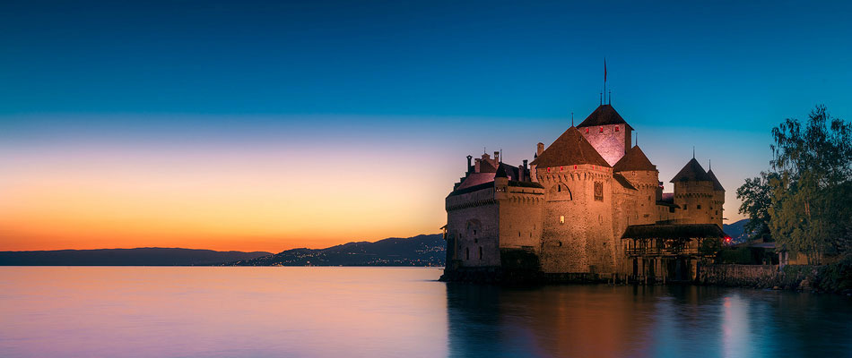

#sliderjs【造轮子，升技能】
基于原生Javascript+CSS3实现，对不支持CSS3 Transition过渡属性的浏览器会降级处理
浏览器支持：IE6+、Firefox、Chrome、safari以及国产XX核浏览器
##如何使用
HTML：
```
<div class="slide" id="slide">
    <div class="slide-bd">
        <ul>
            <li><a href="#1"></a></li>
            <li><a href="#2"></a></li>
            <li><a href="#3"></a></li>
            <li><a href="#4"></a></li>
            <li><a href="#5"></a></li>
            <li><a href="#6"></a></li>
        </ul>
    </div>
</div>
```
CSS：
```
.slide{
    position: relative;
    width: 950px;
    height: 400px;
    margin: 0 auto;
}
.slide-bd li{
    float: left;
}
.slide-hd{
    position: absolute;
    left: 0;
    bottom: 10px;
    text-align: center;
    width: 100%;
    font-size: 0;
    line-height: 0;
    word-spacing: 0;
}
.slide-hd li{
    width: 14px;
    height: 14px;
    border-radius: 8px;
    display: inline-block;
    background-color: transparent;
    border: 1px solid #CCC;
    margin: 0 2px;
}
.slide-hd li.active{
    background-color: #CCC;
    border-color: #CCC;
}
.slide-prev-btn,
.slide-next-btn{
    position: absolute;
    top: 50%;
    width: 50px;
    height: 50px;
    margin-top: -25px;
    background-color: rgba(0, 0, 0, .6);
    color: #FFF;
    text-align: center;
    line-height: 50px;
    cursor: pointer;
}
.slide-prev-btn{
    left: 0;
}
.slide-next-btn{
    right: 0;
}
```
JS调用：
```
<script src="slider.js"></script>
<script>

    var slideWrap = document.getElementById('slide');

    var slide = new Slider({
        dom: slideWrap,
        duration: 5000,
        speed: 600,
        effect: 'left',
        isAutoPlay: true,
        trigger: 'click',
        pagination: true,
        navigation: true,
        pauseOnHover: true
    });
</script>
```
代码还有很大优化的空间